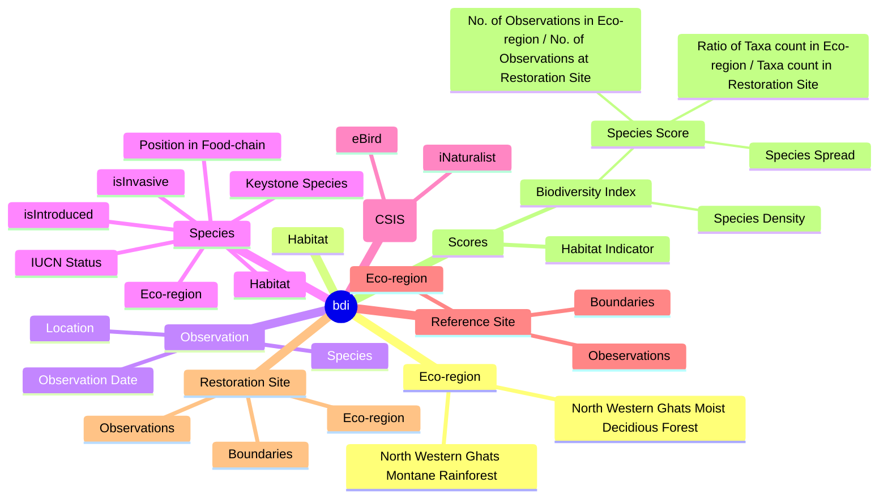
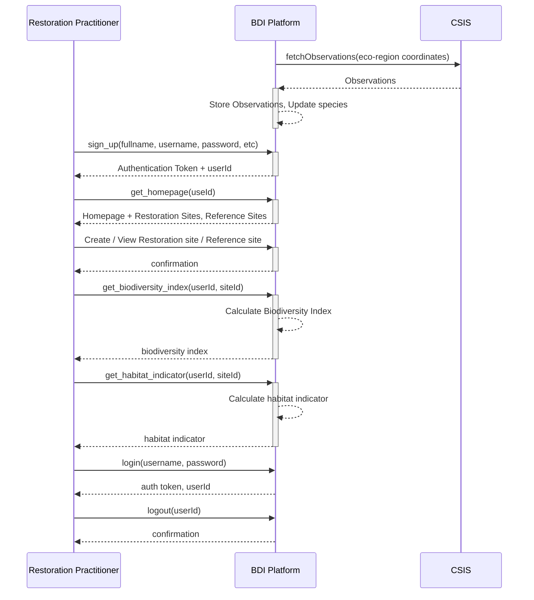
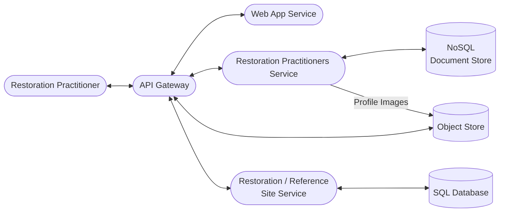

### Purpose
- Build online platform to help restoration practitioners make data-driven decisions to improve "Restore -> Observe -> Analyze" cycle

### Functional Requirements
#### In Scope
1. Restoration Practitioners (RP) can demarcate restoration sites in supported eco-regions
2. Restoration Practitioners can demarcate reference sites in supported eco-regions
3. Biodiversity Index - Derived for a restoration site in-context of the eco-region where the site belongs to
4. Restoration Site -> Reference Site(s) Comparator - restoration practioner can select reference site(s) and compare her restoration site index with that of reference site(s)
5. Habitat Indicator -> indicates how a given restoration site is evolving over-time in-terms of habitat niches

#### Out of Scope
1. Ability to add observations. RPs have to do it directly to supported Crowdsourced Species Identification System (CSIS), atleast in current version being built
2. Native Mobile Apps support
3. Discussion Forum

### Quality Requirements
#### Scalability
1. Millions of observations coming from CSIS(s) in the first fetch
2. Thousands of observations coming from CSIS(s) in subsequent fetches (depending on the fetch frequency & number of eco-regions supported)
3. Thousands of RPs - most RPs spending 1-2 hours/day
#### Availability
1. Aim for 99.9% uptime
#### Performance
1. < 2secs of web-page load-time at 95pt

### Brainstorming

### Domain Model / Concept Model

### System's APIs

#### System APIs Listing
1. sign_up(fullname, username, password, email, profileimage) -> auth token, userId
2. login(username, password) -> auth token, userId
3. logout(userId) -> confirmation
4. get_homepage(userId) -> homepage + RP's restoration and reference sites
5. create_site(userId, polygon, siteType) -> siteId. siteType - restoration | reference
6. update_site(userId, siteId, polygon, siteType) -> siteId
7. delete_site(userId, siteId) -> confirmation
8. get_biodiversity_index(userId, siteId) -> biodiversity index
9. get_habitat_indicator(userId, siteId) -> habitat indicator

### System Architecture (WIP)

#### Notes
1. CDN will be leveraged to reduce latency.
2. All services will have multiple instances and will be behind a load-balancer
3. Databases will be sharded & will have database replication
