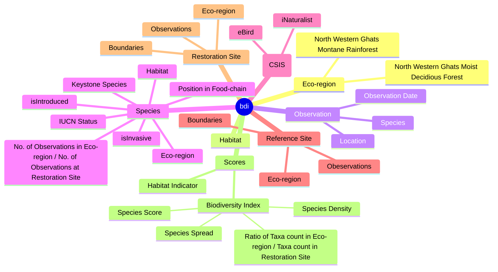
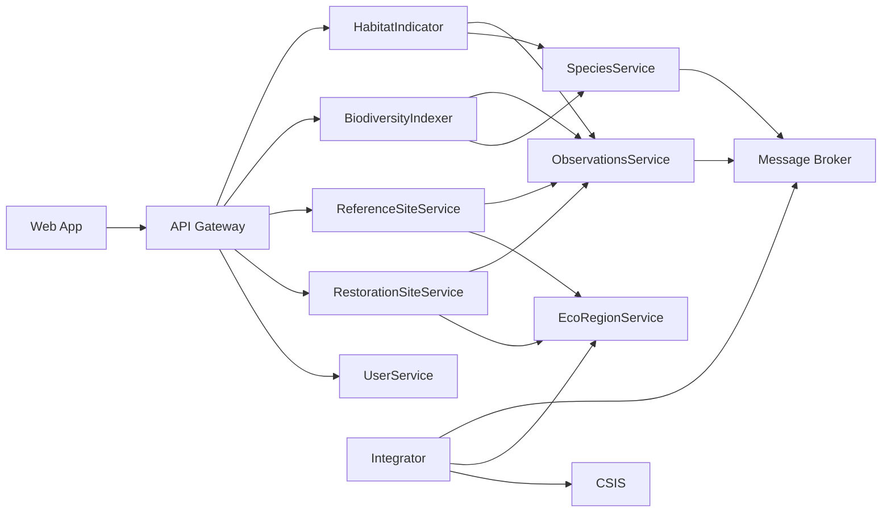
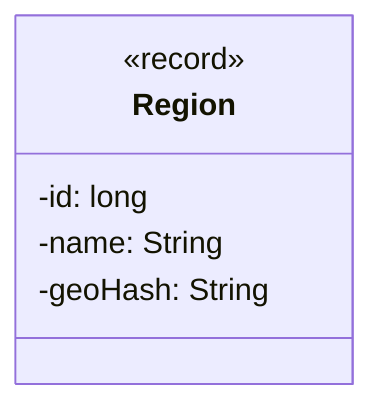

### Purpose
- Help restoration-practitioners make data-driven decisions
- Restore -> Observe -> Analyze 

### Tools
- Biodiversity Index Calculator
- Reference Site(s) Comparator
- Habitat Detector

### Brainstorming


### Sketching


### APIs
#### EcoRegionService

##### getRegion()
```Region getRegion(lat:double, lng:double)```

