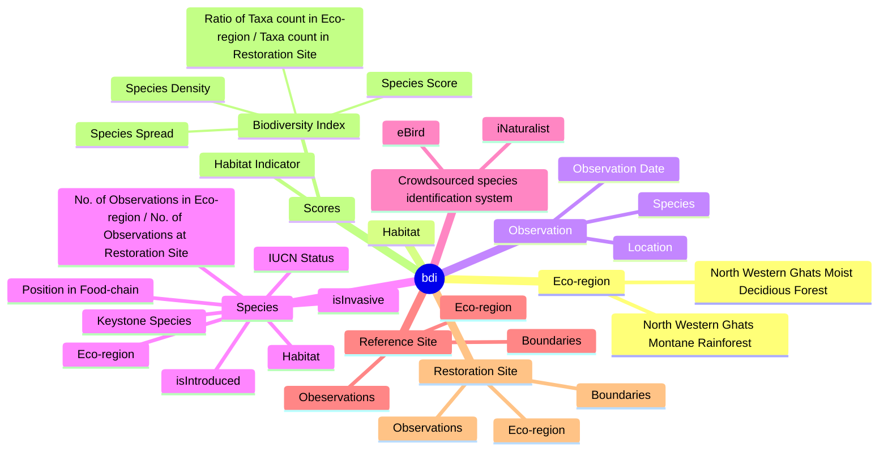

```mermaid
    mindmap
      root((bdi))
        Eco-region
          North Western Ghats Montane Rainforest
          North Western Ghats Moist Decidious Forest
        Habitat
        Observation
          Location
          Observation Date
          Species            
        Species
          Eco-region
          Habitat
          Keystone Species
          IUCN Status
          isInvasive
          isIntroduced
          No. of Observations in Eco-region / No. of Observations at Restoration Site
          Position in Food-chain            
        Crowdsourced species identification system
          iNaturalist
          eBird
        Reference Site
          Boundaries
          Obeservations
          Eco-region
        Restoration Site
          Boundaries
          Observations
          Eco-region
        Scores
          Biodiversity Index
            Species Density
            Species Spread
            Species Score
            Ratio of Taxa count in Eco-region / Taxa count in Restoration Site
          Habitat Indicator
              
```

