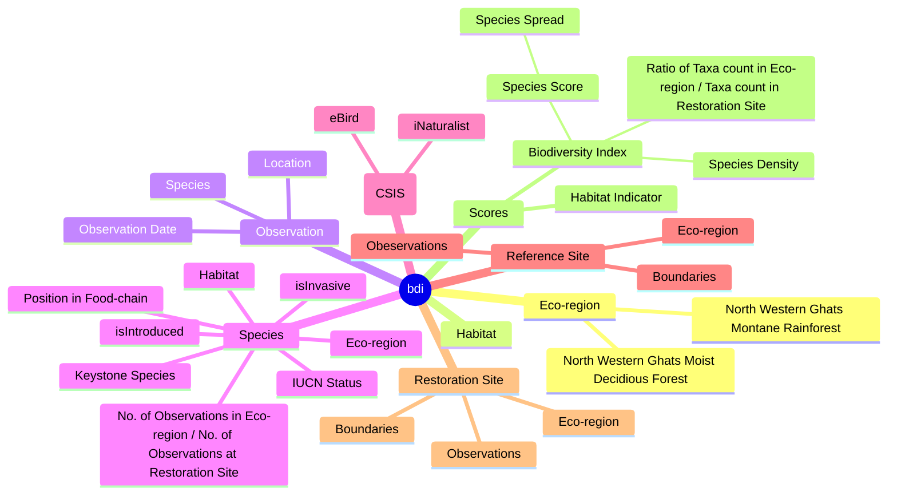
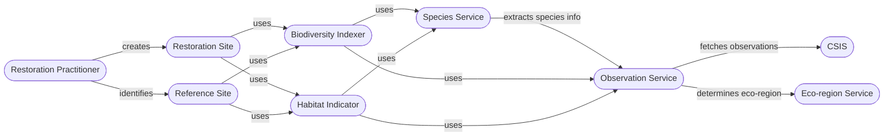
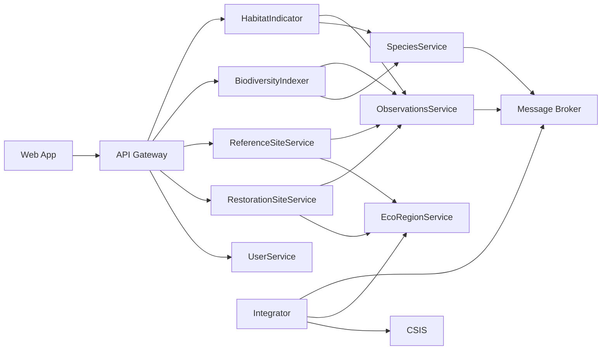
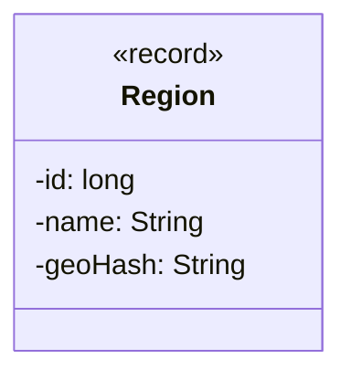

### Purpose
- Help restoration practitioners make data-driven decisions to improve Restore -> Observe -> Analyze cycle

### Functional Requirements
#### In Scope
1. Restoration Practitioners (RP) can demarcate restoration sites in supported eco-regions
2. Restoration Practitioners can demarcate reference sites in supported eco-regions
3. Biodiversity Index - Derived for a restoration site in-context of the eco-region where the site belongs to
4. Restoration Site -> Reference Site(s) Comparator - restoration practioner can select reference site(s) and compare her restoration site index with that of reference site(s)
5. Habitat Indicator -> indicates how a given restoration site is evolving over-time in-terms of habitat niches

#### Out of Scope
1. Ability to add observations. RPs have to do it directly to supported CSIS, atleast in current version being built
2. Native Mobile Apps support. 

### Quality Requirements
1. 

### Brainstorming


### Domain Model / Concept Model


### Sketching


### APIs
#### EcoRegionService

##### getRegion()
```Region getRegion(lat:double, lng:double)```

